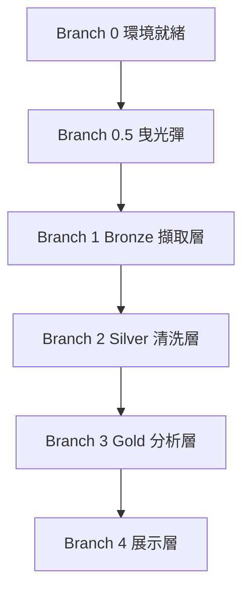

# SilverFlow

**願景：** 以本地 DuckDB + dbt 模擬企業級 Medallion 架構，串接合成健康資料與衛福部長照開放資料，打造面試可說的完整 DE 作品集專案。

---

## 核心工作流程

1. **擷取（Bronze）**：Python 下載衛福部長照機構 CSV、用 Faker 生成 100 位虛擬使用者 × 90 天健康時間序列，落地為 DuckDB raw tables
2. **清洗（Silver）**：dbt models 做型態轉換、去重、異常值過濾、補齊缺漏日期
3. **建模（Gold）**：dbt models 產出健康週趨勢、各縣市長照缺口分析、跨域關聯
4. **展示**：Jupyter Notebook（EDA）+ Datasette（互動瀏覽）

---

## Tech Stack

- **資料倉儲：** DuckDB（本地，零設定）
- **資料轉換：** dbt Core（dbt-duckdb adapter）
- **合成資料：** Python + Faker + 手刻統計分布
- **政府資料：** 衛福部長照機構清單 CSV（data.gov.tw）
- **視覺化：** Jupyter Notebook + Datasette
- **套件管理：** uv + pyproject.toml
- **版本控制：** Git + GitHub

---

## 資料模型規範

### Bronze（raw 原始，不動）

| Table | 來源 |
|---|---|
| raw_ltc_facilities | 衛福部長照機構 CSV |
| raw_health_records | 合成健康資料（user_id, date, age, sleep_hrs, hrv, steps, stress） |

### Silver（清理標準化）

| Table | 內容 |
|---|---|
| stg_ltc_facilities | 清理縣市名稱、統一機構類型、去除重複 |
| stg_health_records | 型態轉換、異常值過濾、補齊缺漏日期 |

### Gold（分析聚合）

| Table | 內容 |
|---|---|
| gold_ltc_gap | 各縣市 65+ 人口 vs 長照床位缺口 |
| gold_health_weekly | 每人每週健康趨勢、各年齡層平均指標 |
| gold_ltc_health_cross | 高壓力/低活動量 65+ 使用者 vs 當地長照資源密度 |

---

## AI 協作守則

1. **最小修改原則：** 每次只做達成當前任務的最小修改，不得動到與任務無關的檔案或模組
2. **質疑新增：** 引入新 library 或建立新檔案前，必須先說明為何現有結構無法解決
3. **先求跑通，再求完美：** 重構是獨立任務，不在同一個 commit 內混做
4. **拒絕發散：** 一次 commit 只解決一件事
5. **dbt 測試必寫：** 每個 Silver/Gold model 至少一條 not_null + unique test
6. **完成的定義（DoD）：** `dbt run` + `dbt test` 全綠才算 done

---

## Branch 依賴圖



> 各 Branch 嚴格串行，後者依賴前者的 DuckDB schema。

---

## Branch 0：環境就緒確認

**Input：** 開發機 Python 3.11+、Git 可用
**Output：** 所有工具確認可執行
**Success criteria：**
- [ ] `uv` 安裝完成，`uv --version` 可執行
- [ ] 虛擬環境建立：`uv venv .venv`
- [ ] 安裝 duckdb、dbt-duckdb、faker、pandas、jupyter、datasette
- [ ] `python -c "import duckdb; print(duckdb.__version__)"` 輸出版本號
- [ ] `dbt --version` 輸出版本號
- [ ] 專案目錄結構建立完成

**專案目錄結構：**
```
silverflow/
├── data/
│   ├── bronze/
│   ├── silver/
│   └── gold/
├── ingestion/
│   ├── download_ltc.py
│   └── generate_health.py
├── dbt/
│   ├── dbt_project.yml
│   ├── profiles.yml
│   └── models/
│       ├── bronze/
│       ├── silver/
│       └── gold/
├── notebooks/
│   └── eda.ipynb
├── pyproject.toml
└── AGENTS.md
```

---

## Branch 0.5：曳光彈（Tracer Bullet）

> 最短路徑走通整條 pipeline，不求美觀，只求驗證可行。

**目標路徑：** 生成 5 筆假健康資料 → 落地 DuckDB Bronze → 一個 dbt Silver model 跑通 → Datasette 可瀏覽

**Input：** Branch 0 所有項目完成
**Output：** Datasette 頁面可見 Silver table 資料
**Success criteria：**
- [ ] `generate_health.py` 輸出 5 筆 CSV 到 `data/bronze/`
- [ ] DuckDB 成功 `COPY` 進 `raw_health_records`
- [ ] `dbt run --select stg_health_records` 成功
- [ ] `datasette silverflow.duckdb` 啟動，瀏覽器可見資料

---

## Branch 1：Bronze 擷取層

**Input：** Branch 0.5 曳光彈通過
**Output：** 兩份原始資料完整落地 DuckDB
**Success criteria：**
- [ ] [GREEN] `download_ltc.py` 下載衛福部 CSV，落地 `raw_ltc_facilities`（至少 100 筆）
- [ ] [GREEN] `generate_health.py` 生成 100 位虛擬使用者 × 90 天，落地 `raw_health_records`（9,000 筆）
- [ ] [GREEN] 年齡分布合理：65+ 佔 40%、中年 35%、健康對照組 25%
- [ ] [GREEN] 健康指標分布符合各族群設定（65+ HRV 偏低、中年壓力偏高）
- [ ] [REFACTOR] 兩支 ingestion script 各自獨立，可單獨重跑

---

## Branch 2：Silver 清洗層

**Input：** Branch 1 Bronze tables 就緒
**Output：** 兩個乾淨的 stg models，dbt test 全綠
**Success criteria：**
- [ ] [RED] `stg_ltc_facilities`：縣市名稱不統一時 test 報錯
- [ ] [GREEN] `stg_ltc_facilities`：縣市標準化、機構類型 accepted_values 通過
- [ ] [GREEN] `stg_health_records`：異常值過濾（sleep < 0 或 > 24、HRV < 0）
- [ ] [GREEN] `stg_health_records`：缺漏日期補齊（每位 user 必須有完整 90 天）
- [ ] [GREEN] `dbt test` 全部通過（not_null、unique、accepted_values）

---

## Branch 3：Gold 分析層

**Input：** Branch 2 Silver models 就緒
**Output：** 三個分析 Gold models，面試可展示的洞察
**Success criteria：**
- [ ] [GREEN] `gold_ltc_gap`：各縣市 65+ 人口 / 長照床位比例計算正確
- [ ] [GREEN] `gold_health_weekly`：週平均 HRV、睡眠、步數、壓力計算正確
- [ ] [GREEN] `gold_ltc_health_cross`：可找出「高壓力 + 低活動量 + 65+ + 長照資源不足縣市」的使用者
- [ ] [REFACTOR] Gold models 加上 `description` 欄位（dbt schema.yml）

---

## Branch 4：展示層

**Input：** Branch 3 Gold models 就緒
**Output：** 可展示的 Notebook + Datasette
**Success criteria：**
- [ ] [GREEN] `eda.ipynb`：至少 3 張圖（長照缺口長條圖、健康趨勢折線圖、跨域散點圖）
- [ ] [GREEN] Datasette 可瀏覽所有 Bronze/Silver/Gold tables
- [ ] [GREEN] README 說清楚：架構圖、執行步驟、面試故事

---

## 當前狀態

**最後更新：** 2026-04-20
**目前進度：** Branch 0 準備中

### 下一步
- 建立 `pyproject.toml` 並用 `uv` 安裝依賴
- 建立目錄結構
- 確認 dbt-duckdb 設定可跑通
