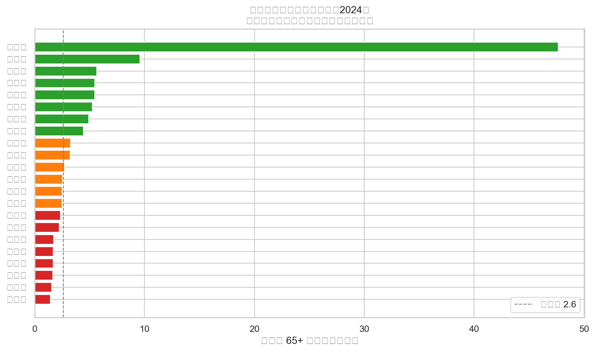
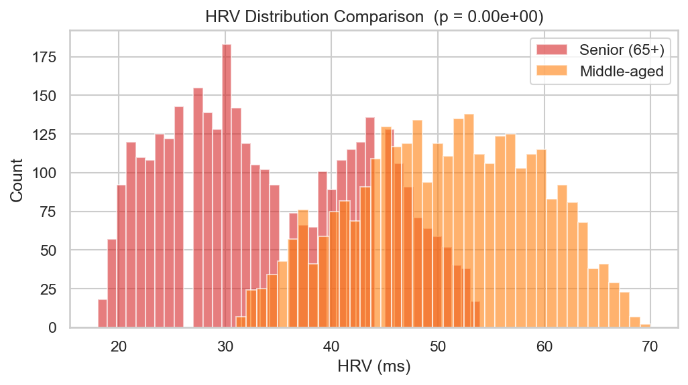
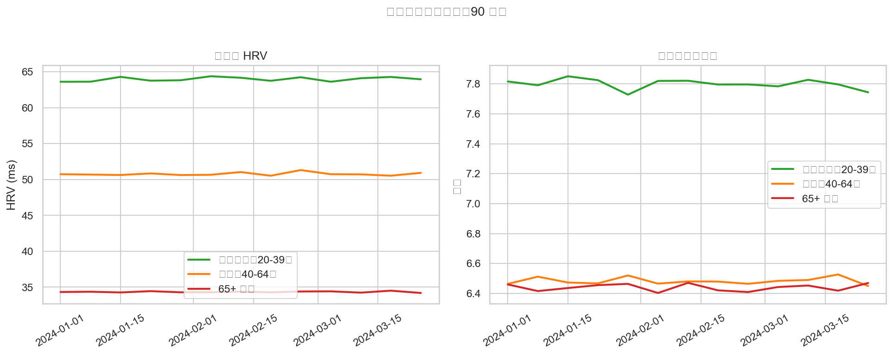
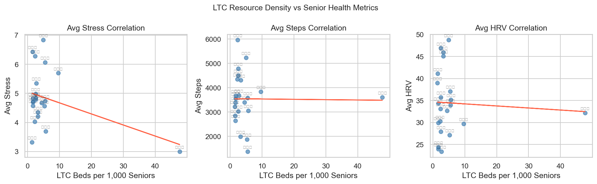
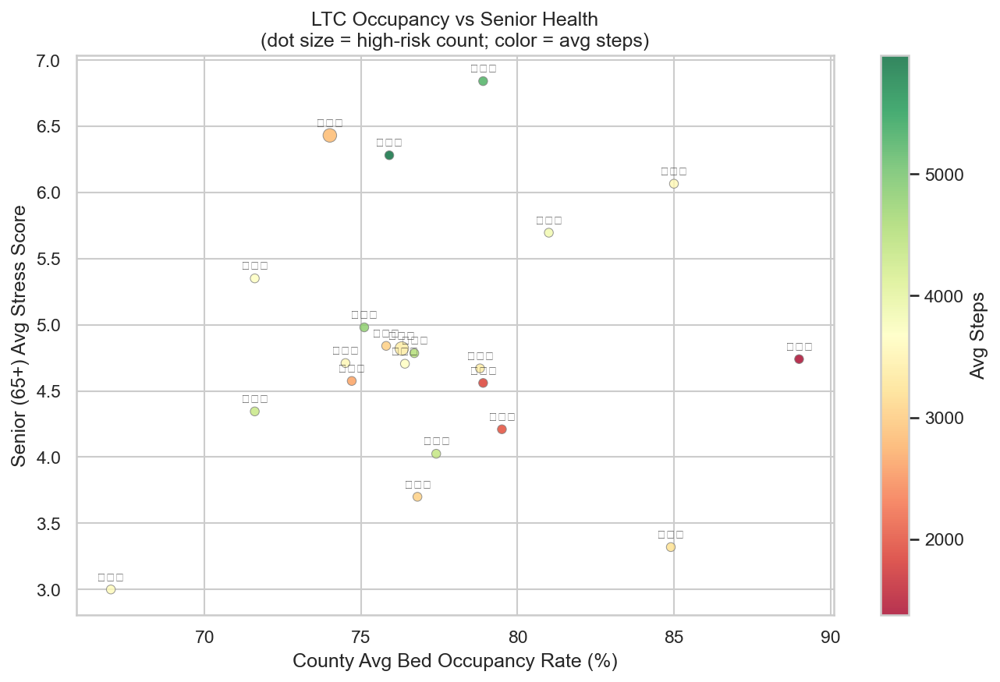

# SilverFlow

以本地 DuckDB + dbt 實作 Medallion 架構，串接合成健康資料與政府長照開放資料，打造可展示的 Data Engineering 作品集。

---

## 架構圖

```
資料來源
  ├── ingestion/generate_health.py   → 100 人 × 90 天合成健康時序資料
  ├── ingestion/generate_ltc.py      → 合成長照機構清單（262 筆，22 縣市）
  └── ingestion/download_population.py → 內政部統計處 2024 年縣市 65+ 人口（真實資料）
         │
         ▼ ingestion/load_bronze.py
┌─────────────────────────────────────────────────────────┐
│  Bronze（DuckDB raw tables）                             │
│  raw_health_records │ raw_ltc_facilities │ raw_population │
└──────────────┬──────────────────────────────────────────┘
               │ dbt run (silver/)
┌──────────────▼──────────────────────────────────────────┐
│  Silver（清洗標準化）                                     │
│  stg_health_records  │  stg_ltc_facilities               │
└──────────────┬──────────────────────────────────────────┘
               │ dbt run (gold/)
┌──────────────▼──────────────────────────────────────────┐
│  Gold（分析聚合）                                         │
│  gold_ltc_gap  │  gold_health_weekly  │  gold_ltc_health_cross │
└──────────────┬──────────────────────────────────────────┘
               │
    ┌──────────┴──────────┐
    ▼                     ▼
 Datasette           Jupyter Notebook
 (互動瀏覽)          (EDA + 統計檢定)
```

---

## Tech Stack

| 層次 | 工具 |
|---|---|
| 資料倉儲 | DuckDB（本地，零設定） |
| 資料轉換 | dbt Core + dbt-duckdb adapter |
| 合成資料 | Python + Faker |
| 政府開放資料 | 內政部統計處（人口）、合成長照機構 |
| 視覺化 | Jupyter Notebook + Matplotlib + Seaborn |
| 統計 | SciPy（Welch t-test、Pearson/Spearman correlation） |
| 資料瀏覽 | Datasette |
| 套件管理 | uv |

---

## 快速開始

```bash
# 1. 安裝套件
uv sync

# 2. 生成與下載資料
uv run python ingestion/generate_health.py
uv run python ingestion/generate_ltc.py
uv run python ingestion/download_population.py

# 3. 載入 Bronze
uv run python ingestion/load_bronze.py

# 4. 執行 dbt（Silver + Gold）
cd dbt
uv run dbt run
uv run dbt test      # 應全綠：33 tests PASS

# 5. 匯出 SQLite 供 Datasette
cd ..
uv run python ingestion/export_to_sqlite.py
uv run datasette silverflow_view.sqlite

# 6. 開啟 Notebook
uv run jupyter lab notebooks/eda.ipynb
```

---

## 資料模型

### Bronze — 原始落地，不動

| Table | 來源 | 筆數 |
|---|---|---|
| `raw_health_records` | 合成健康時序 | 9,000 |
| `raw_ltc_facilities` | 合成長照機構清單 | 262 |
| `raw_population` | 內政部統計處 2024 年縣市 65+ 人口 | 22 |

### Silver — 清洗標準化

| Table | 重點處理 |
|---|---|
| `stg_health_records` | 型態轉換、異常值過濾、補齊缺漏日期（date spine） |
| `stg_ltc_facilities` | 縣市名稱標準化、機構類型驗證、使用率計算 |

### Gold — 分析聚合

| Table | 指標 |
|---|---|
| `gold_ltc_gap` | 各縣市每千位 65+ 長照床位數（`beds_per_1000_seniors`）、使用率 |
| `gold_health_weekly` | 每人每週 HRV、睡眠、步數、壓力週平均 |
| `gold_ltc_health_cross` | 65+ 高風險旗標（高壓力 + 低活動量 + 高使用率縣市） |

---

## 分析洞察

**長照缺口**：新竹市每千位 65+ 僅 1.41 張床，為全台缺口最大縣市；連江縣因人口極少（65+ 僅 2,244 人）床位比看似充裕。

**族群健康差異**：Welch t-test 顯示 65+ 族群 HRV 均值（34.3）顯著低於中年族群（50.8），p < 0.001，符合 HRV 隨年齡下降的生理規律。

**相關性**：受限於合成資料的縣市 deterministic 分配，長照資源密度與健康指標之間的統計相關未達顯著（n=22 縣市）；在真實資料中此分析才具意義。

---

## 面試故事

> 「這個專案我想解決的問題是：台灣長照資源分配不均，但現有公開資料很分散。我用 dbt Medallion 架構把三層資料（Bronze 原始、Silver 清洗、Gold 分析）分開管理，確保每層可獨立重跑且 dbt test 全綠。過程中我發現合成資料缺乏地理欄位，主動去爬內政部統計處的開放資料 API 補上真實的縣市 65+ 人口，讓 beds_per_1000_seniors 這個指標有了實際意義。最後在 Notebook 做了 t-test 和相關性分析，並誠實記錄合成資料的限制，讓分析結果可以被正確解讀。」

---

## 分析成果視覺化

### 1. 各縣市長照床位缺口排名



以每千位 65+ 人口的核定長照床位數衡量各縣市資源密度。綠色（充裕）、橘色（偏低）、紅色（嚴重不足），虛線為全台中位數 2.6 床。連江縣因 65+ 人口極少（2,244 人）使比率拉至最高；新竹市都會化快速、高齡化進程加速，床位比僅約 1.4，為缺口最大的縣市。

---

### 2. HRV 族群分布與 Welch t-test



以重疊直方圖比較 65+ 長者（紅）與中年族群（橘）的 HRV 分布。兩群體幾乎不重疊：長者集中於 20–35 ms，中年集中於 40–65 ms。Welch t-test p 值趨近於 0，顯示族群差異具有極高統計顯著性，符合 HRV 隨年齡下降的生理規律。

---

### 3. 90 天週均健康趨勢



追蹤三個年齡群體（青年 20–39、中年 40–64、長者 65+）在 2024 年 Q1 的每週平均 HRV 與睡眠時長。兩項指標均呈現穩定的族群分層，且 90 天內無明顯時序波動——確認合成資料的族群特性一致，可用於族群比較分析。

---

### 4. 長照資源密度與健康指標相關性



以縣市為單位，散點圖呈現長照床位密度（X 軸）與三項 65+ 健康指標（壓力、步數、HRV）的關係。受限於合成資料採 deterministic 縣市分配（n = 22），迴歸線斜率雖有方向性但相關未達統計顯著，此限制已在分析洞察章節中明確說明。

---

### 5. 長照使用率 × 高風險族群交叉分析



多維度氣泡圖：X 軸為縣市平均床位使用率、Y 軸為 65+ 平均壓力分數、氣泡大小代表高風險人數（高壓力 + 低活動量）、顏色代表平均步數（綠色多、紅色少）。可識別出「高使用率且高壓力」的縣市，作為長照資源分配優先關注的候選區域。
